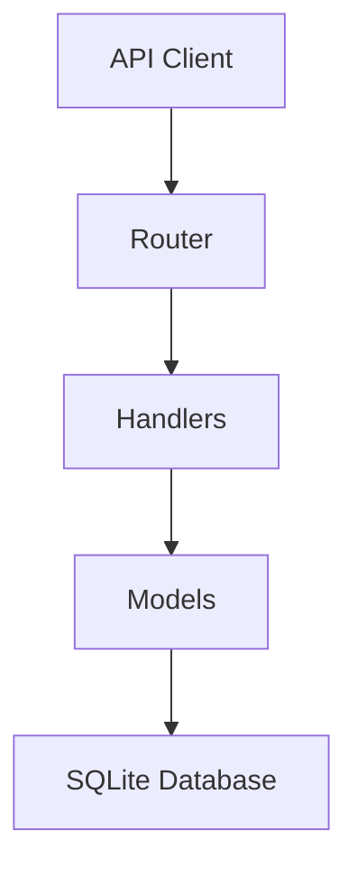

# Language Learning Portal - Backend

REST API backend for managing Spanish vocabulary learning.

## Current Features

✅ Implemented:
- Vocabulary group management
- Word storage with Spanish/English pairs
- Study session tracking
- Basic progress statistics
- Data import from JSON

🚧 In Progress:
- Advanced progress tracking

## Project Structure

```text
backend_go/
├── cmd/
│   └── server/          # Main application
├── internal/
│   ├── handlers/       # API endpoint handlers
│   ├── models/         # Database models
│   └── middleware/     # Authentication and logging
├── db/
│   └── migrations/     # Database schema versions
├── Makefile            # Build commands
└── README.md           # This documentation
```

## Development Setup

1. Clone repository
   ```bash
   git clone https://github.com/chaimaeazg/genai_bootcamp.git
   cd backend/backend_go
   ```

2. Install dependencies
   ```bash
   go mod download
   ```

3. Initialize database
   ```bash
   make migrate  # Creates database structure
   ```

4. Import initial data
   ```bash
   curl -X POST http://localhost:8080/api/import-initial-data
   ```

5. Start server
   ```bash
   make run      # Runs on port 8080
   ```

## Key Endpoints

| Method | Endpoint                   | Description                |
|--------|----------------------------|----------------------------|
| GET    | /api/groups                | List all word groups       |
| GET    | /api/groups/{id}/words     | Get words in a group       |
| POST   | /api/import-initial-data   | Seed initial vocabulary     |
| GET    | /api/dashboard/quick-stats| Get learning statistics     |

## API Documentation

Current API endpoints are listed below.

## API Endpoints

### Groups
- GET /api/groups - List all groups
- GET /api/groups/:id/words - Get words in a group

### Words
- GET /api/words - List all words
- GET /api/words/:id - Get word details

### Study Sessions
- POST /api/study_sessions - Create new session
- GET /api/study_sessions - List all sessions

### Data Import
- POST /api/import-initial-data - Import initial vocabulary data

## Environment Configuration

Create `.env` file:
```ini
DB_PATH=words.db
PORT=8080
```

## Deployment

Build production binary:
```bash
make build
```

Run production server:
```bash
./bin/server
```

## Architecture


